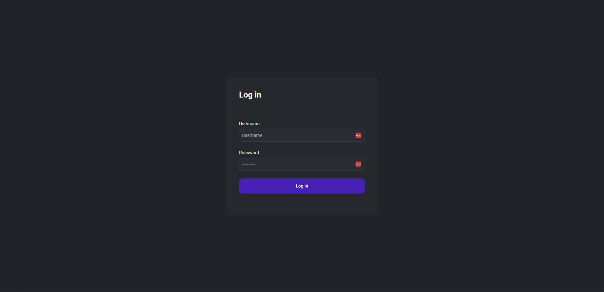
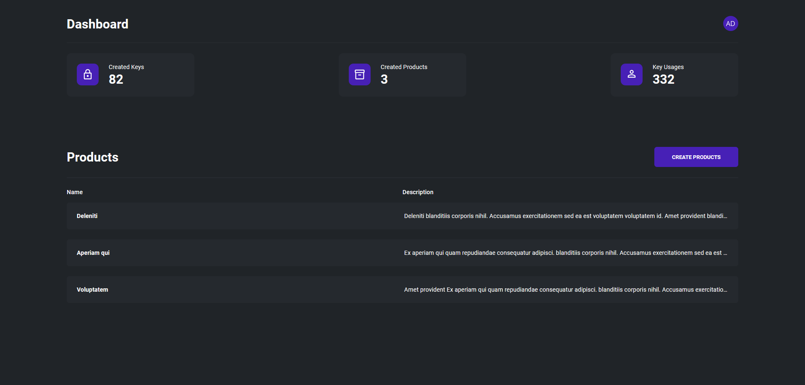
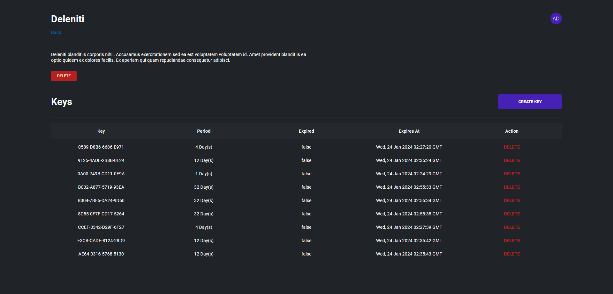

# 🔑 License Manager

This is a license manager that allows you to create products and generate keys.

## Initial Setup

1. Clone the repository.
2. Install the dependencies with:
  ```shell
  pip install -r requirements.txt
  ```
4. Run the project with:
  ```shell
  python run.py
  ```
*The default user is **"admin"** with the password **"123"***

## API Documentation

The application has a swagger API documentation available at `/docs`. The documentation includes details about each route, including the necessary parameters and expected responses.

## Usage with Python

You can use the API with Python using the package in the python_package folder, it contains some snippets on how to communicate with the server.

### Snippets

Verifying a Key:
```py
from license_package import LicenseManager

license_manager = LicenseManager("http://127.0.0.1:5000")

is_expired, error = license_manager.is_expired("CDFC-E5B0-1A5B-9F94")
if is_expired:
    print(f"Error: {error}")
else:
    print(f"The key is valid")
```

Getting Key Info:
```py
import json
from license_package import LicenseManager

license_manager = LicenseManager("http://localhost:5000")

key_info, error = license_manager.get_key_info("CDFC-E5B0-1A5B-9F94")
if key_info is not None:
    formatted_key_info = json.dumps(key_info, indent=4)
    print(f"Key Info: {formatted_key_info}")
else:
    print(f"Error: {error}")
```

## Images

Login



Dashboard



Product Dashboard



## License

This project is licensed under the MIT license.
